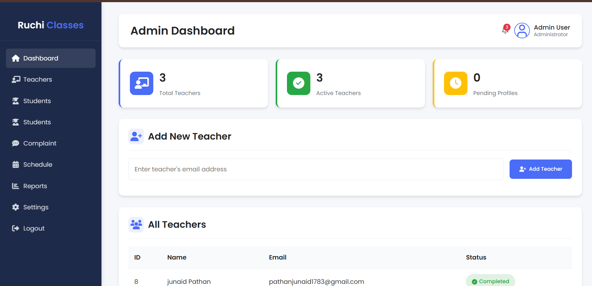

# Ruchi Classes Management System

Ruchi Classes is a web-based management system designed to manage classes, teachers, students, and attendance efficiently.

## Modules
- Admin Panel
- Teacher Panel
- Student Panel

## Features
- Secure login system
- Role-based access (Admin, Teacher, Student)
- Attendance management
- Class and medium based student handling
- Dashboard for each user role

## Technologies Used
- HTML
- CSS
- JavaScript
- PHP
- MySQL

## Project Structure
admin/
teacher/
student/
assets/
index.php
config.php

## 📸 Project Screenshots

### Admin Dashboard

### Teacher Assignment

### home page

### Student Management

Contact Me:
Taufiq Khan – BCA Student
📞 Phone: 9023019948
📧 Email: 23bca107@gsfcuniversity.ac.in
 / tk366430@gmail.com
